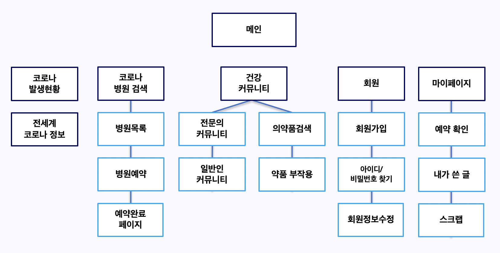
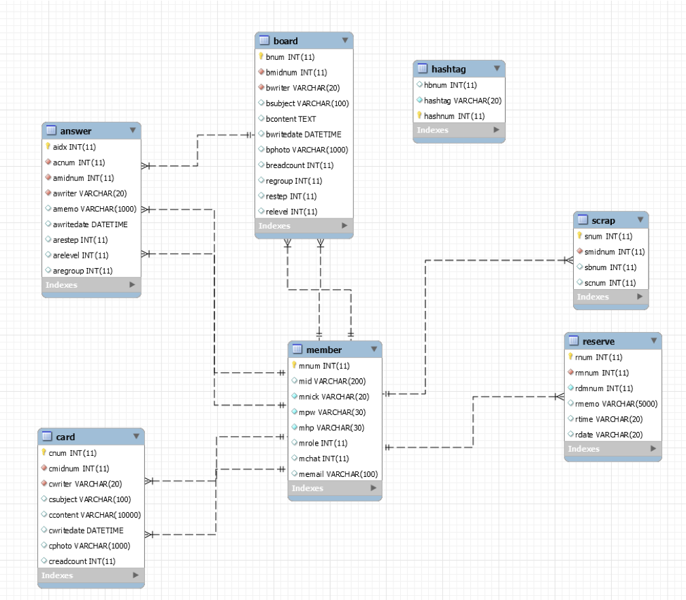
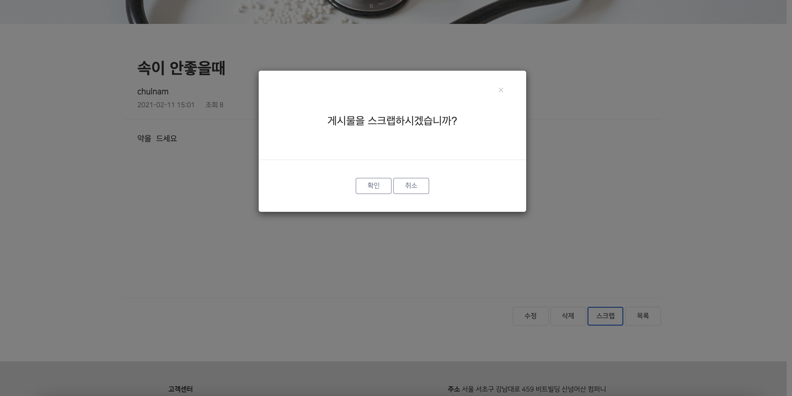
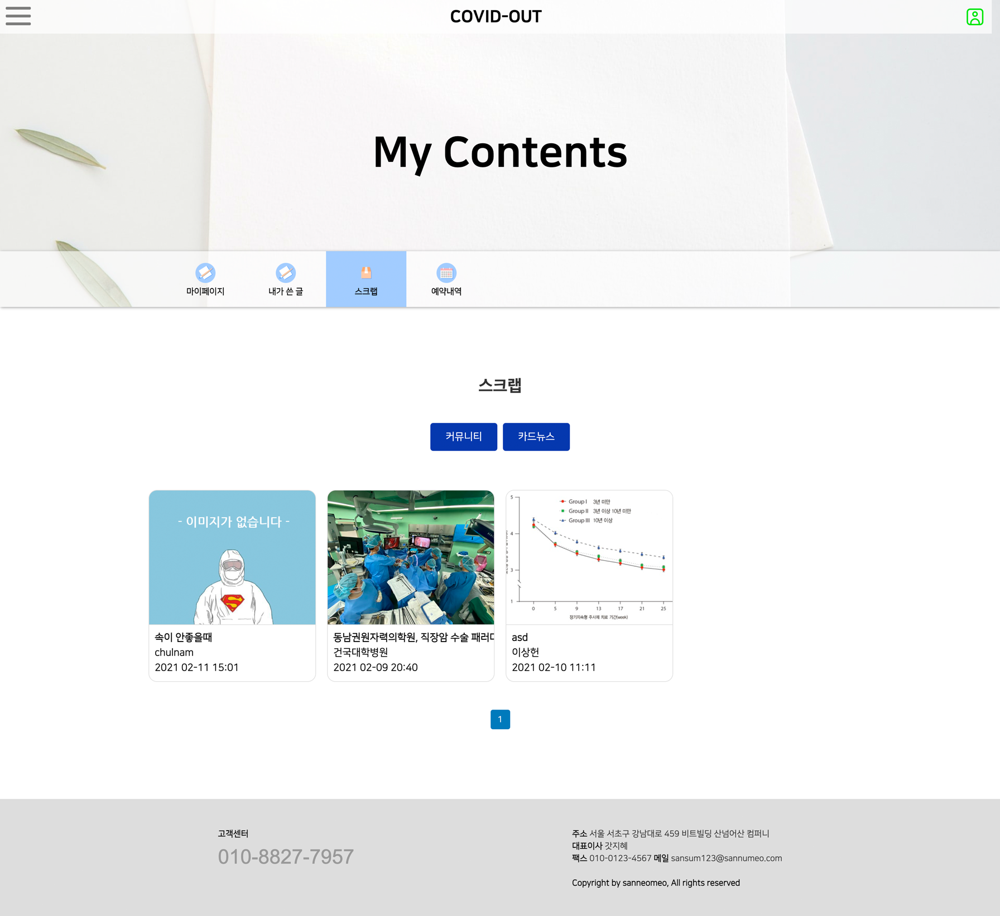

# Covid-Out

Created: 2021년 1월 11일 → 2021년 2월 14일
Type: JSP, MySQL, Spring, Website
속성: https://github.com/minjeong13/Covid-Out.git

## Read me ──

현재 코로나로 인한 정보가 부족과 병원 정보가 부족한 문제를 개선하고자
일일 코로나 확진자 수를 그래프로 명확하게 보여주고, 전문 의사들이 코로나에 대한 정보를 알려주는 커뮤니티, 각 나라별 코로나 방역 수칙, 일반 의료 정보 공유 커뮤니티, 코로나 관련 병원 예약 시스템을 구축하였습니다.
메인은 원 페이지 스크롤링 방식으로 구현하였고, 반응형으로 제작하였습니다.
로그인 및 회원가입에는 구글과 카카오 로그인 API를 사용하였고, 메인에 일일 확진자수를 나타내기 위해 코로나 라이브를 활용하여 '지방 자치단체 및 질병 관리청'이 당일 제공하는 API를 활용하였습니다.

저는 다양한 기능 중 전문 의료진이 제공하는 코로나 관련 정보 공유 커뮤니티 페이지 구현과 각 나라별 방역수칙 페이지 구현을 하였습니다. 전문 의료진이 제공하는 코로나 관련 정보 페이지는 최신 글들을 상단에 카드형식으로 자동 스크롤이 되도록 하였으며, 하단에 전체 글이 카드형식으로 페이징이 되도록 구현하였습니다.
스프링 프레임워크를 사용하여 각 페이지 마다 별도의 폴더 생성 후 컨트롤러와 DAO, DTO를 생성하여 페이지를 구현하였습니다. 
그리고 개발 최종 완료 후, 메인, 로그인, 카드뉴스, 커뮤니티, 마이페이지의 전체적인 아웃풋 수정을 하였습니다.

### Git File >

CovidOut> src > main > java > Mybatis/setting

- 각 페이지 별 Sql 파일 저장

CovidOut > src > main > webapp > WEB-INF

- 각 페이지별 아웃풋 JSP 파일 저장

CovidOut> src > main > java > spring

- 각 페이지 별 컨트롤러 및 DAO 파일 저장
- mainpage : 메인 페이지의 원페이지 스크롤링기능 구현
- member :  코비다웃 로그인 및 카카오, 구글 로그인 API 연동
- mypage : 마이페이지에서 회원 정보 수정, 커뮤니티 글 스크랩 목록 출력, 병원 예약 내역 출력.
- board : 코로나 또는 건강 관련 정보를 주고받는 보드형 커뮤니티 페이지. 해시태그로 검색 가능.
- answer : board 커뮤니티의 글에 댓글 기능 제공
- card : 카드형식 커뮤니티 페이지로, 전문 의사들이 코로나 관련 정보를 제공한다.
- scrap : 두개의 커뮤니티 페이지에서 스크랩한 글을 DB에 저장해 마이페이지에서 리스트로 출력
- safe : 나라별 방역수칙 API로 가져와 정보 제공
- hospital : 코로나 관련 병원 정보 제공. 병원 API를 사용하여 병원 목록을 출력하고, 병원 위치 제공
- medicine : 약품 정보 제공. 약품 정보 API를 사용하여 약품 이름 검색시 해당 약품에 대한 정보 제공
- reserve : 코비다웃과 협력한 병원은 병원 정보 페이지에서 병원 진료 예약 기능 제공

## Site Map ──

## DB ──

## OutPut ──

### Main

### Safe

### Card

### Card Detail Page

### Card Detail Page Scrap

